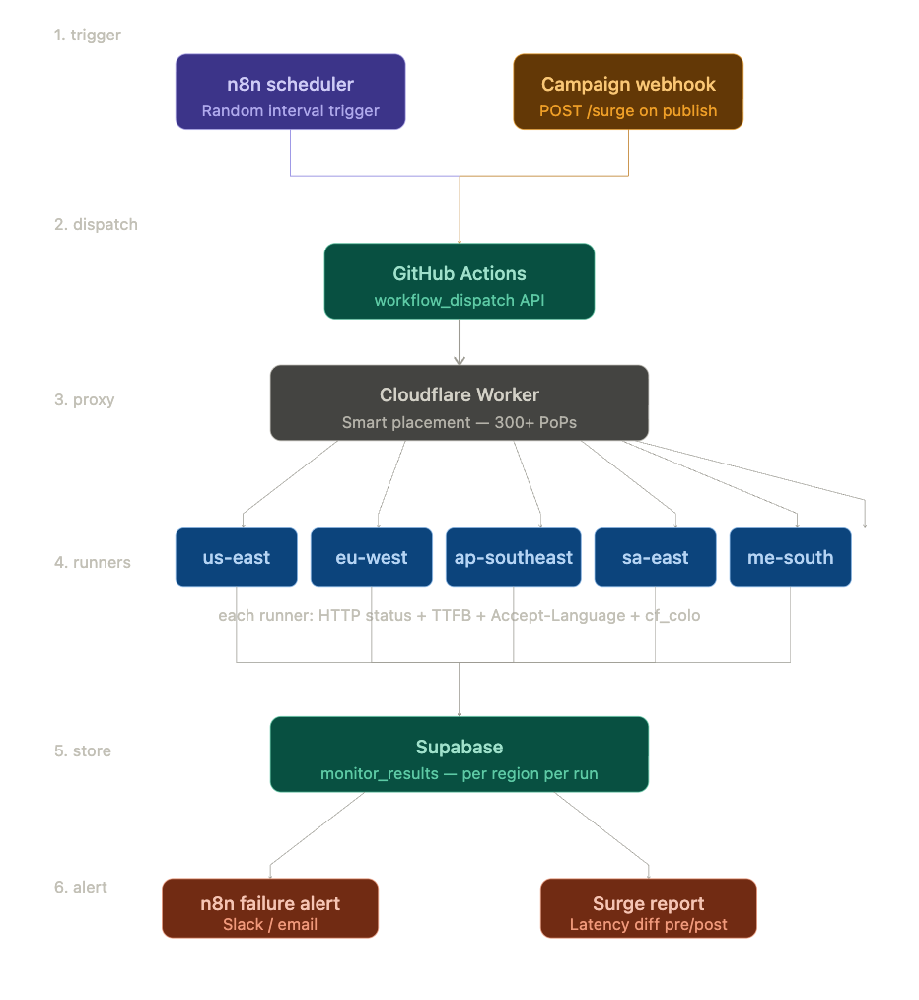
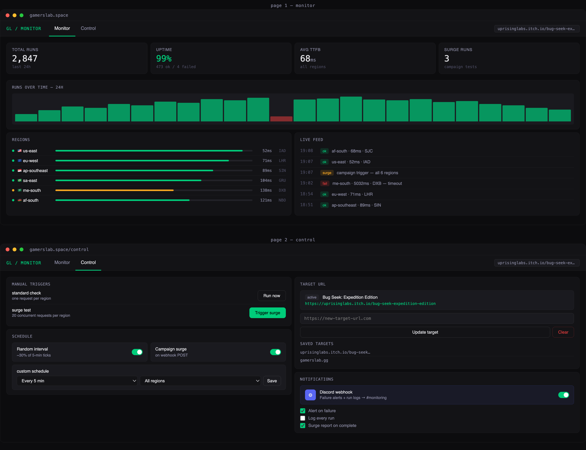

# geo-monitor

Geo-distributed availability and load testing pipeline for a single URL. Checks that your site is up, fast, and serving the correct language from six global regions — on a randomised schedule and on demand when campaigns go live.

**Stack:** GitHub Actions · Cloudflare Workers · n8n · Supabase  
**Cost:** $0 (all free tiers)

---

## How it works

### Pipeline steps

```
1. TRIGGER
   n8n fires on a random interval (~30% of every 5-min tick)
   OR a campaign webhook fires manually on social post / publish

2. DISPATCH
   n8n calls the GitHub Actions workflow_dispatch API
   Passes mode (standard | surge) and region list as inputs

3. PROXY
   Each runner calls the Cloudflare Worker URL
   Cloudflare smart placement routes the request through the nearest
   edge PoP to that runner — giving genuine geo-distributed egress IPs

4. RUNNERS
   GitHub spins up parallel Ubuntu runners (one per region)
   Each runner sends an HTTP request with the correct Accept-Language
   header for its region, records status, TTFB, Content-Language, and
   the Cloudflare PoP code (cf_colo) that served the request
   In surge mode each runner fires 20 concurrent requests

5. STORE
   Each runner pushes its result row to Supabase (monitor_results table)
   Columns: region, status, ttfb_ms, content_language,
            accept_language_sent, cf_colo, mode, checked_at

6. ALERT
   n8n queries Supabase every 15 min for failures in the last 30 min
   Sends Slack / email if any region returned a non-2xx status
   Post-campaign: compares average TTFB in surge vs standard rows
```

### Regions monitored

| Region label | Accept-Language sent | Expected language |
|---|---|---|
| `us-east` | `en-US,en;q=0.9` | English |
| `eu-west` | `fr-FR,fr;q=0.9,en;q=0.8` | French |
| `ap-southeast` | `zh-CN,zh;q=0.9,en;q=0.8` | Chinese |
| `sa-east` | `pt-BR,pt;q=0.9,en;q=0.8` | Portuguese |
| `me-south` | `ar-SA,ar;q=0.9,en;q=0.8` | Arabic |
| `af-south` | `sw-KE,sw;q=0.9,en;q=0.8` | Swahili |

---

## Architecture

```
┌─────────────────────┐        ┌──────────────────────┐
│   n8n scheduler     │        │  Campaign webhook     │
│  Random interval    │        │  POST /surge          │
└────────┬────────────┘        └───────────┬──────────┘
         │                                 │
         └──────────────┬──────────────────┘
                        ▼
              ┌─────────────────────┐
              │   GitHub Actions    │
              │  workflow_dispatch  │
              └─────────┬───────────┘
                        ▼
              ┌─────────────────────┐
              │  Cloudflare Worker  │
              │  smart placement    │
              │  300+ global PoPs   │
              └──────┬──────────────┘
          ┌──────────┼──────────┬──────────┬──────────┐
          ▼          ▼          ▼          ▼          ▼
       us-east    eu-west   ap-southeast sa-east  me-south
       runner     runner     runner      runner   runner
          └──────────┴──────────┴──────────┴──────────┘
                              │
                              ▼
                    ┌──────────────────┐
                    │    Supabase      │
                    │ monitor_results  │
                    └────────┬─────────┘
               ┌─────────────┴──────────────┐
               ▼                            ▼
       n8n failure alert           Surge latency report
       Slack / email               pre vs post TTFB diff
```

---

## Repository structure

```
.
├── .github/
│   └── workflows/
│       └── monitor.yml          # Main workflow — standard + surge modes
├── worker/
│   ├── src/
│   │   └── worker.js            # Cloudflare Worker proxy
│   └── wrangler.toml            # Worker config — smart placement enabled
├── supabase/
│   └── schema.sql               # monitor_results table + useful queries
├── n8n/
│   ├── scheduler.json           # Workflow A — random interval trigger
│   ├── surge-webhook.json       # Workflow B — campaign surge trigger
│   └── alerting.json            # Workflow C — failure detection + notify
└── README.md
```

---

## Setup

### Prerequisites

- GitHub account (free)
- Cloudflare account (free, no domain needed)
- Supabase project (free tier)
- n8n instance (self-hosted or n8n cloud free tier)
- Node.js + npm (for Wrangler CLI)

### 1. Supabase — create the results table

Run `supabase/schema.sql` in the Supabase SQL editor:

```sql
create table monitor_results (
  id                   bigserial primary key,
  region               text not null,
  status               int,
  ttfb_ms              float,
  duration_ms          float,
  content_language     text,
  accept_language_sent text,
  cf_colo              text,
  mode                 text,
  checked_at           timestamptz default now()
);
```

Note your **project URL** and **service role key** from Project Settings → API.

### 2. Cloudflare Worker — deploy the proxy

```bash
npm install -g wrangler
wrangler login

cd worker
wrangler secret put TARGET_URL
# paste your site URL when prompted

wrangler deploy
# outputs: https://geo-monitor.<your-account>.workers.dev
```

Note the worker URL — you'll add it as a GitHub secret.

### 3. GitHub — add secrets

In your repo go to Settings → Secrets and variables → Actions:

| Secret name | Value |
|---|---|
| `WORKER_URL` | `https://geo-monitor.<your-account>.workers.dev` |
| `SUPABASE_URL` | Your Supabase project URL |
| `SUPABASE_SERVICE_KEY` | Supabase service role key |

### 4. n8n — import workflows

Import the three JSON files from `n8n/` into your n8n instance:

- **scheduler.json** — fires `workflow_dispatch` at random intervals. Set `GITHUB_PAT` as an n8n credential (needs `repo` + `actions` scopes).
- **surge-webhook.json** — exposes a POST webhook at `/webhook/surge`. Call this from your social scheduling tool before a campaign goes live.
- **alerting.json** — polls Supabase every 15 minutes. Configure your Slack webhook or email credentials.

---

## Running a check manually

Trigger a standard check via the GitHub UI:

1. Go to Actions → Geo Monitor → Run workflow
2. Set mode: `standard`, leave regions as default
3. Watch all six region jobs run in parallel

Trigger a surge test:

```bash
curl -X POST https://your-n8n.com/webhook/surge
```

Or trigger directly via the GitHub API:

```bash
curl -X POST \
  -H "Authorization: Bearer YOUR_GITHUB_PAT" \
  -H "Accept: application/vnd.github+json" \
  https://api.github.com/repos/YOUR_ORG/YOUR_REPO/actions/workflows/monitor.yml/dispatches \
  -d '{"ref":"main","inputs":{"mode":"surge"}}'
```

---

## Querying results

Compare standard vs surge latency by region:

```sql
select
  region,
  mode,
  round(avg(ttfb_ms)::numeric, 0)      as avg_ttfb_ms,
  round(avg(duration_ms)::numeric, 0)  as avg_duration_ms,
  count(*) filter (where status = 0)   as failures,
  count(*)                             as total_checks
from monitor_results
group by region, mode
order by region, mode;
```

Check which Cloudflare PoPs are actually serving each region:

```sql
select region, cf_colo, count(*) as hits
from monitor_results
group by region, cf_colo
order by region, hits desc;
```

Recent failures only:

```sql
select region, ttfb_ms, checked_at
from monitor_results
where status = 0
  and checked_at > now() - interval '24 hours'
order by checked_at desc;
```

---

## How geo distribution works

GitHub's hosted runners get a fresh public IP on every run from Microsoft Azure's global infrastructure. The Cloudflare Worker sits in front of your site — when a runner calls the worker URL, Cloudflare's smart placement routes the proxied request through the nearest edge node to that runner. The `cf_colo` field in each result row records the actual Cloudflare airport code (e.g. `SYD`, `LHR`, `DXB`, `NBO`) so you can verify the geo spread without inspecting raw IPs.

No AWS account, no self-hosted infrastructure, no cost.

---

## Limitations

- GitHub's free runner pool is Azure-hosted and US-biased — runner IPs are not pinned to specific cities, only broadly regional.
- Surge mode fires 20 concurrent requests per runner (120 total across 6 regions). Scale the concurrency in `monitor.yml` for heavier load tests.
- Cloudflare's free Workers plan allows 100,000 requests/day — sufficient for monitoring but not for sustained high-concurrency load testing.
- n8n cloud free tier has limited workflow executions per month; self-hosted n8n has no limit.

---

## License

MIT

---

# Control Hub Dashboard

The app is an internal ops dashboard for a game monitoring pipeline. The aesthetic should feel like mission control — dark, precise, data-dense but never cluttered. Monospace for data, clean sans for UI. The signature element: a real-time activity feed that makes the pipeline feel alive. Two pages: **Monitor** (analytics + live feed) and **Control** (triggers + schedule + target config).

---



### Dashboard Mockup


## Architecture decisions

The React app at `gamerslab.space` never calls GitHub or n8n directly — everything goes through a single **Cloudflare Worker API** that acts as the backend. This keeps secrets server-side and gives you one place to add auth later.

## API stubs needed

The Worker needs 5 endpoints:

```
GET  /api/results?hours=24          → reads Supabase monitor_results
GET  /api/status                    → returns last run per region (live status)
POST /api/trigger                   → dispatches GitHub Actions workflow_dispatch
                                      body: { mode: 'standard' | 'surge', regions?: string[] }
POST /api/schedule                  → updates n8n workflow schedule via n8n REST API
                                      body: { interval: number, regions: string[] }
PUT  /api/target                    → updates TARGET_URL secret in Cloudflare Worker
                                      + stores in Supabase targets table for history
                                      body: { url: string, name?: string }
```

## Additional n8n workflow needed

Yes — for the target URL change, you need a 4th n8n workflow: **Workflow D — target URL sync**. When the Worker receives a `PUT /api/target`, it updates the Cloudflare Worker secret AND posts to an n8n webhook that restarts the scheduler with the new target. Without this, existing scheduled runs would still hit the old URL.

## Discord vs Slack

Workflow C (alerting) needs updating — swap the Slack node for an HTTP Request node posting to a Discord webhook URL. Discord's webhook format is just `{ "content": "message" }` which is simpler than Slack blocks anyway.

## Two-page React structure

```
/           → Monitor page (analytics, live feed, region table, time range)
/control    → Control page (manual triggers, schedule, target URL, Discord config)
```

Cloudflare Pages deploys from `dashboard/` folder in the repo, auto-builds on push.

---

Ready to build? The build order would be: Worker API → React scaffold → Monitor page → Control page → Discord alert update. Which piece do you want first?