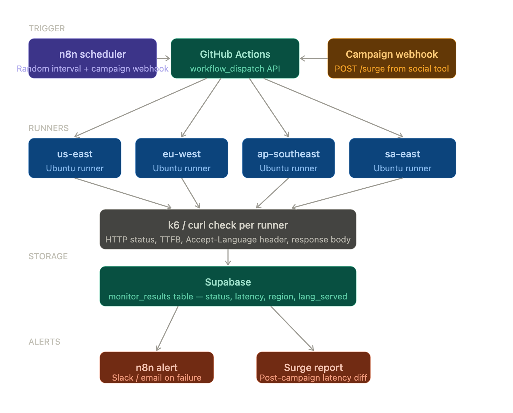

GitHub's hosted runners get different public IPs on every run automatically — you don't need to manage this. They're genuinely different IPs from different AWS/Azure regions depending on the runner pool. You can verify by logging curl ifconfig.me in the workflow if you want to record the egress IP per run alongside results in Supabase.

For more granular geo control (specific cities rather than broad regions), the next step up is a tool like k6 Cloud which has 30+ load zones — but GitHub's native runners cover the major regions for most availability testing purposes.

Secrets to add in GitHub
Secret	Value
TARGET_URL	The URL you're monitoring
SUPABASE_URL	Your Supabase project URL
SUPABASE_SERVICE_KEY	Service role key (not anon)
And in n8n: GITHUB_PAT with repo and actions scopes.

Free tier (all GitHub accounts):

2,000 minutes/month on public repos — unlimited
500 minutes/month on private repos
Runners are ubuntu-latest — no cost

Geo limitations on free:

You get GitHub's default runner pool — no region pinning
Runners are spread across Azure globally but you can't specify "give me EU" explicitly
In practice you get US-biased IPs most of the time

USE CLOUDFLARE

export default {
  async fetch(request, env) {
    const target = env.TARGET_URL;
    return await fetch(target, {
      headers: request.headers
    });
  }
}